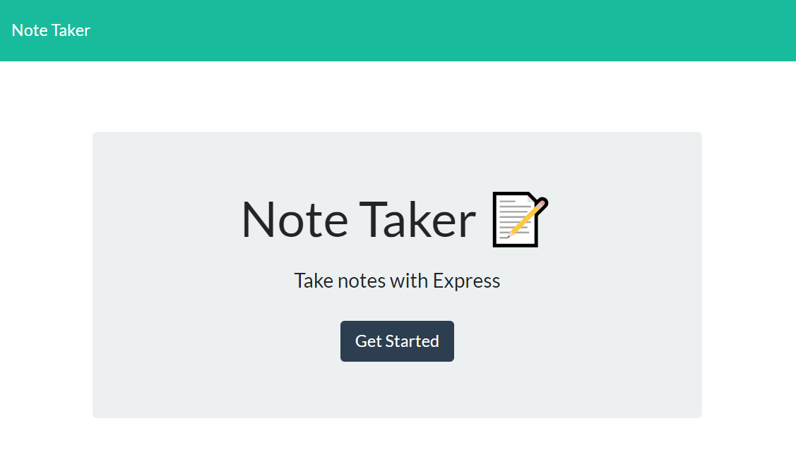
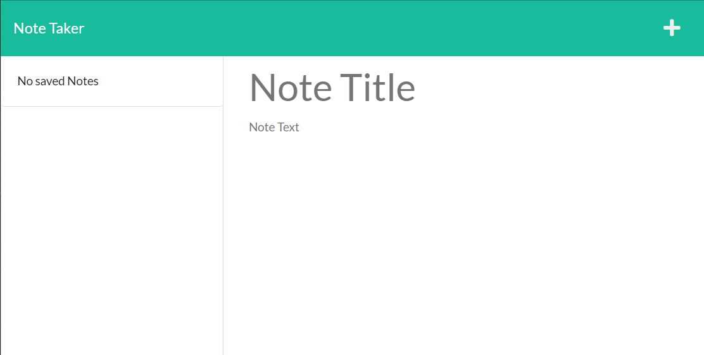
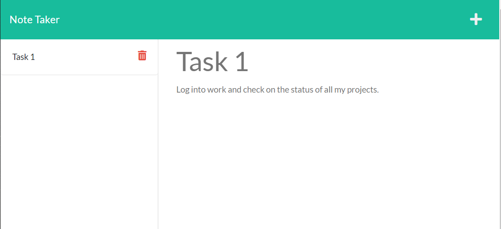

# 11-Express-takingNotes
Challenge 11

## Description: 
This application was created for the user to be able to write and save their notes to keep track of the tasks they need to complete.

Once you open the deployed site you are given an empty space to create a new note. After filling in the title and text you can then save the note and it will be displayed on the left hand side. You can click on the coressponding trash icon to delete notes. If you'd like to create a new note, you can click on the plus icon.

## Installation
Make sure to install all your dependencies, this uses express and uniquid npm packages.

## Usage

link to github project page: https://github.com/va-lopez/11-Express-takingNotes
link to deployed application: https://express-11-taking-notes.herokuapp.com/

